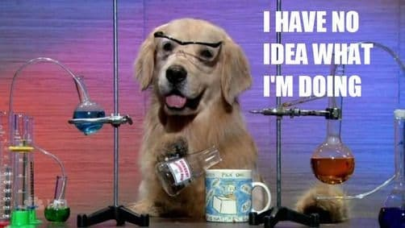
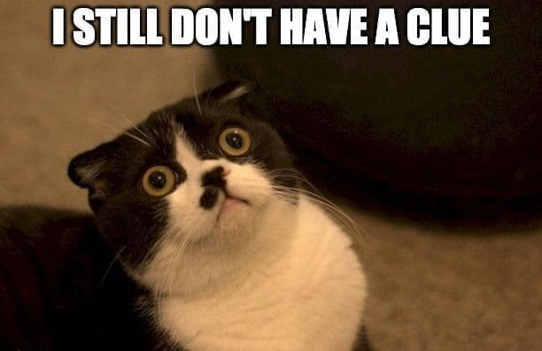
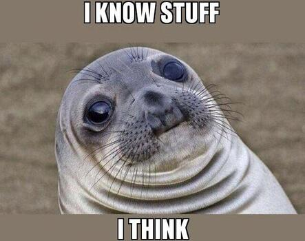
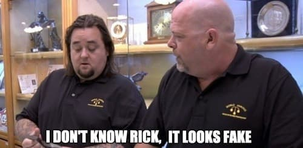
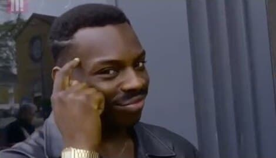

People ask me for tips for learning something in specific, sometimes I make the same question and is an interesting topic because the human mind is different and there is a lot of learning models out there to achieve it. Recently I discovered the **Dreyfus model** of skill acquisition and I was astonished by how it explains with basic concepts how we can progress and improve ourselves to achieve our goals.

This year I've been experimenting with different techniques on my daily life like obtaining more sleep hours. One of the things I love to do is, before going to the bed, ask me **what did I learn today?**. The procrastination has been a bad habit that I'm fighting every single day and finally I can see I'm winning that battle, but that's a story for another post.

One of the most powerful forms of self-improvement is learning new skills but the process of acquiring them isn't clear. Yes, we can read a book or be in a workshop for that, but is a hard task that will require a lot of effort. There are different stages of learning, and most of the people aren't excited to be in the early process.

## The Drey... what?

The _[Dreyfus model](http://www.dtic.mil/cgi-bin/GetTRDoc?AD=ADA084551&Location=U2&doc=GetTRDoc.pdf)_ is a *framework* to measure your progress in any skill. Whether you want to learn a new language, become a dancer or learn how to write; this model will help you to get a perspective on where are you and how to improve to go for the next level with it.

Invented by **Stuart** and **Hubert Dreyfus** in 1980, stablish that acquiring a skill employing instruction and experience, the student normally passes trough **five developmental stages**. These stages are:

- Novice
- Advanced Beginner
- Competent
- Proficient
- Expert

It can be hard to know in which stage a person is because almost **everyone wants to be at the expert level** without even touch the **novice level**.

Nothing is easy, **every skill requires effort and time** to develop it. If you had no impediments
that restrained you from learning how to walk, maybe you already forgot that you learned by
imitation and trial-and-error. Probably you had an instructor to aid you and encourage you to
keep trying while giving useful tips. But... **are you an _expert_ on walking?** *Maybe not*, and that's
fine. Not everyone wants to be participate professionally on a walking marathon. But, if that's
your goal, then you should keep looking forward to improving that skill.

## Novice

The novice stage is the first level of skill acquisition where you are just getting started in the skill and have little familiarity with it. Because you don't have any idea of what you're doing or how to keep advancing, the best way of acquiring knowledge is by following a set of rules to complete the task within the skill.

Something interesting about the description of this stage is that a student graduating from college
who only focused on his grades might be a novice or possibly isn't at this level. **Some students are focused on their grades rather than learning** and do something with the obtained knowledge. Not everyone learns how to learn. **A Teacher probably isn't an expert**, and being an expert doesn't sent you automatically to an expert stage on teaching skill. A teacher doesn't know the answers of everything, but he may have an idea of where you can acquire the answers.

Someone who is learning how to drive needs to learn when to shift to the next gear after the speedometer points to a certain number. However, a person who is at this level could tell you that hears the motor to know when it needs to shift.

## The Advanced Beginner

Once we learned the basic rules, we will probably reach this stage. After coping from real examples, we will start understanding the context and noting the variables that matter in the recipe.

For example, as an advanced beginner programmer, you will try to add more functionality to your first program, maybe you will change some variables and see if it still works.

You have the experience of how to initiate a project with a new programming language and learned the basics so you can start to develop the idea in your mind. **You will find a lot of errors and will fail a lot**.

[Don't Panic](https://en.wikipedia.org/wiki/Phrases_from_The_Hitchhiker%27s_Guide_to_the_Galaxy#Don't_Panic), the errors will help us to reason about the why. **We are in a stage of experimentation beyond the examples that were given to us**. You have a safe environment to deal with new things.

Although we've reached this stage, we haven't fully understood the whole context and still need
some guidance about why or how things should go. Eventually, with more exposure to the skill and
more practice, **we will start to understand the importance of each part of the information** and be
able to walk to the next stage.

## Competent

At this phase, we will be able to recognize patterns and the things are going to start to get interesting —_finally_— and frustrating —_oh no!_—.

Here **we stopped to follow a set of rules**, and we discover how to apply them in our tasks. Maybe we don't need all the rules for our current task and thanks to the previous stage experimentation, we will be able to have a better perception of what does each of one.

In algebra, I started to skip to write some steps as I found it easy to follow them in my head, and if you like it, you probably did the same. **We start to learn how to ignore the rules, we start to play with them**.

Something curious about this stage is that **we start to get emotively involved with the outcome** because the rules are form by ourselves. This is why when we success, we experiment a huge joy for the correct set of rules.

This is a hard stage as now the subject is attached to the outcome and can be very difficult to deal with failure. **The key to success is learning by failing**. If you can overcome this and have a perspective on why things went wrong, then you can start changing the recipe for making less prone to errors the set of rules you're managing.

## Proficient

At this stage, the involved, experienced performer sees goals and salient aspects but not what to do to achieve these goals. This means that **you're pretty good at what you do**.

The proficient performer simply has not yet had enough experience with the outcomes of the wide variety of possible responses to each of the situations **he or she can now discriminate among to react automatically**.

For example, if you are a programmer, you will see a code and feel that something isn't good, maybe the way the variables are named or could be possible that there are too many things happening in one block and is hard to read or reason about. 

**You know that it doesn't sound right**. *That code smells*.

Although you already identify the smell, **you still need to make a conscious selection among the options on how to fix it**. Probably you will try different paths to see which one is the best option.

## Expert

Normally an expert does not calculate.

He or she does not solve problems.

He or she does not even think.

He or she just does what normally works and, of course, **it normally works**. 

At this point, the expert sees immediately how to achieve the task with his or her vast repertoire of tools. **The ability to make more subtle and refined discriminations is what distinguishes the expert from the proficient performer**.

As you can notice, **the expert operates entirely by intuition** and, to the outside spectators, this could seem like magic. For example, there are a lot of famous people in different areas and, if you see them live or in the video, you will look at how they can perform their skill as if it were breathing.

## Wrap up

This is very interesting, and after I discover it, I've been trying to train some of my weak points on the skills that I want to grow. I believe that this is really helpful to understand that we always are a novice and how can we reach the next stage. So, **always start by following a recipe**, then **experiment by adding more things** and **discover the why** of the outcome.

According to the *Dreyfus brothers*, **most of the people are in the advanced beginner stage**. That's something really hard to process at first, and I believe that a good method is to believe that we are on that stage, even if we are experts in one skill. I like what Socrates said: 

> The only true wisdom is in knowing you know nothing

With that phrase on my mind, **I always try to learn something new everyday**

I hope that you've learned something new today.

And remember, enjoy the ride when learning.

**Read you soon!**