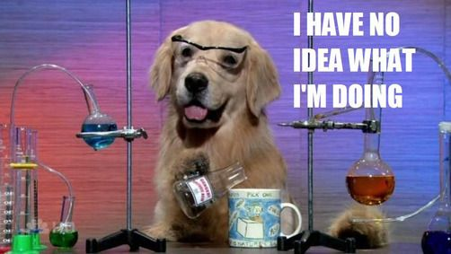

Las personas me preguntan por tips para aprender algo en específico, a veces yo hago esa misma pregunta y es un tema muy interesante porque la mente humana es diferente y existen diferentes modelos de aprendizaje para poder lograrlo. Recientemente descubrí el **método Dreyfus** de adquisición de habilidades y quedé fascinado por cómo este modelo explica la manera de progresar y lograr nuestras metas.

Éste año he estado experimentando con diferentes técnicas en mi vida diaria como el tratar de obtener mejores horas de sueño. Una de las cosas que me encanta hacer es, antes de dormir, preguntarme:

**¿Qué aprendí hoy?**

La *procrastinación* ha sido un mal hábito con el que lucho todos los días y por fin puedo ver que estoy ganando la batalla, pero esa es una historia para otro post.

Una de las formas más poderosas de superación personal es **aprender nuevas habilidades**, pero el proceso de adquirirlos no es claro. Sí, podemos leer un libro o comenzar un curso pero ¿qué existe después?.

Existen diferentes etapas de aprendizaje y la mayoría de las personas no están emocionadas de encontrarse en el proceso inicial.

## El modelo Dre...qué?

El [modelo Dreyfus](http://www.dtic.mil/cgi-bin/GetTRDoc?AD=ADA084551&Location=U2&doc=GetTRDoc.pdf) es un *framework* para medir tu progreso en cualquier habilidad. Ya sea que quieres aprender un nuevo idioma, convertirte en un bailarín o aprender a escribir; éste modelo te ayudará a tener una perspectiva clára de dónde te encuentras y cómo mejorar para ir al siguiente nivel.

Desarrollada por los hermanos **Stuart** y **Hubert Dreyfus** en 1980, establece que la adquisición de habilidades está **presente en 5 etapas**. Estas etapas son:

- Novato
- Principiante avanzado
- Competente
- Capaz
- Experto

Puede resultar difícil conocer la etápa en la que uno se encuentra ya que la mayoría de las personas quieren ubicarse en la etapa de **experto** y no haber pisado nunca la de **novato**.

Nada es fácil, **cualquier habilidad requiere de esfuerzo y tiempo** para su adquisición. Si no tienes impedimentos para aprender a caminar, tal vez ya olvidaste que esta habilidad la aprendimos por imitación, ensayo y error. Probablemente tuviste un instructor que te apoyó para que quisieras seguir intentándolo mientras obtienes consejos útiles de su parte.

Pero... **¿Éres un experto en caminar?** *Tal vez no*, y eso está bien. No todos quieren participar profesionalmente en maratones de caminata, pero si ese es tu objetivo, entonces debes seguir practicando para mejorarlo.

## Novato

El novato es el primer nivel donde comenzamos a realizar muchas preguntas por nuestra poca familiaridad con el tema. Es por esta razón que para avanzar debemos de seguir una serie de reglas al pie de la letra para completar una tarea.

Algo interesante sobre esta etapa es que un estudiante graduado de la universidad, y el cual su enfoque fue sólo sus calificaciones, podría ser un novato. **Algunos estudiantes están mas enfocados en sus calificaciones que en aprender** y hacer algo con el conocimiento obtenido.

No todas las personas aprenden a aprender.

**Un profesor no precisamente es un experto**, y ser un experto no otorga automáticamente el título de *profesor*. Un profesor no sabrá las respuestás de todo, pero quizá podrá ayudarte a encontrarlas.

Alguien que está aprendiendo a conducir debe aprender cuando cambiar a la siguiente marcha después de que el velocímetro apunta a un cierto número.

Sin embargo, una persona que se encuentra en ésta etapa podría decirte que escucha el motor para saber que se necesita dicho cambio.

## Principiante Avanzado

Una vez que aprendemos las reglas básicas, probablemente hemos llegado a esta etapa. Después de seguir al pie de la letra distintos pasos comenzamos a entender el contexto y las variables que existen en la receta.

Por ejemplo, un principiante avanzado de programación tratará de crear nuevas funciones, cambiar variables o tratar de modificar sentencias para observar su comportamiento.

**En esta etapa encontramos bastantes errores y fallaremos constantemente**. Pero no hay que temer, los errores nos ayudarán a razonar sobre el porque de las cosas.

**Estamos en una etapa de experimentación mas allá de los ejemplos que se nos dieron**. Tienes un ambiente seguro para tratar nuevas cosas.

Llegados a esta etapa aún no hemos entendido el porque de las cosas, aún necesitamos de alguien que nos guíe. Eventualmente, con mas práctica, **comenzaremos a entender la importancia de cada parte** y seremos capaces de caminar a la siguiente etapa.

## Competente

En esta fase seremos capaces de reconocer patrones y las cosas comenzarán a ser interesantes —*por fin*— y frustrantes —*¡Oh no!*—.

Aquí **hemos dejado de seguir las reglas** y descubrimos cómo aplicarlas en cualquiera de nuestras actividades. Quizá no necesitas cada una de las reglas que has aprendido, y gracias a la experimentación de la anterior etapa, tendremos una mejor percepción de lo que hace cada una de ellas.

Por ejemplo, en álgebra podemos omitir ciertos pasos o despejar variables de una fórmula para obtener la que necesitamos sin tener que buscarla en otra parte. **Comenzamos a aprender a ignorar reglas, comenzamos a jugar con ellas.**

Algo curioso en esta etapa es que **comenzamos a involucrarnos emocionalmente con el resultado de nuestra acciones** ya que estas reglas las estamos formando nosotros mismos. Es por eso que al tener éxito, se experimenta una enorme alegría por la elección correcta de los pasos necesarios.

Ésta es una etapa muy difícil ya que estamos muy pendiente al resultado y puede ser muy difícil fallar. **Lo importante para tener éxito es aprender de nuestros fallos**. Si puedes sobreponerte a esto y pensar seriamente de porque las cosas han fallado, las siguientes veces podrás esquivar estos errores con facilidad.

## Capaz

Aquí comenzamos a ver las metas y aspectos destacados, pero no observamos con claridad qué hacer para lograrlo. En pocas palabras, esto significa que **somos muy buenos en lo que hacemos**.

Ser capaces nos da la seguridad de obtener resultados positivos en una amplia variedad de posibles situaciones. **A veces inclusive reaccionaremos automáticamente**.

Por ejemplo, si eres un programador, podrás ver código y sentir que algo no está bien. Quizá el nombre de una variable o posiblemente una función es demasiado difícil de lidiar y podría ser re-escrita de una mejor manera.

**Tú sabes que algo no cuadra**.

Aunque ya se haya identificado los problemas, **aún necesitaremos seleccionar conscientemente entre las diferentes opciones para solucionarlo**. Probablemente se probarán diferentes caminos para ver cuál es la mejor opción.

## Experto

Normalmente un experto no calcula.

No resuelve problemas.

Ni siquiera piensa.

Simplemente hace lo que normalmente funciona y, por supuesto, **lo que hace normalmente funciona**.

En este punto, el experto ve inmediatamente cómo realizar la tarea gracias a su vasto repertorio de herramientas.
 
**La capacidad de realizar discriminaciones refinadas es lo que distingue al experto de la anterior etapa**.

Como puedes notar, **el experto se rige enteramente por la intuición** y, ante la mirada de los espectadores, esto podría parecer un acto de magia.

Por ejemplo, hay un gran número de gente famosa en diferentes areas que, si los ves en vivo o por video, observarás que el realizar su habilidad es como si de respirar se tratase.

## En resúmen

Este fue un tema muy interesante para mi. Después de descubrirlo he comenzado a entrenar los puntos débiles en mi conjunto de habilidades para crecer en ellas.

Creo que es de mucha ayuda ubicar nuestro nivel, entender la razón por la que estamos allí y el cómo seguir escalando al siguiente nivel. 

Recomiendo siempre **comenzar siguiendo una receta**, luego **experimentar** tras cambiar algunos ingredientes y **descubrir el porque de los resultados** tras haber realizado estos cambios.

Según los *hermanos Dreyfus*, **la mayoría de las personas se encuentra en la etapa de principiante avanzado**. Eso es algo duro de procesar al principio. 

Creo que pensar que estamos en esa etapa, aunque realmente seamos expertos, es un buen método para seguir intentado mejorar nuestra habilidad. Me gusta lo que Socrates dijo:

> La única verdadera sabiduría está en saber que nada sabes.

Con dicha frase en mi mente, **siempre trato de aprender algo nuevo cada día**.

Espero que hayas aprendido algo nuevo el día de hoy.

Y recuerda, disfruta del viaje mientras aprendes.

**¡Nos leemos!**