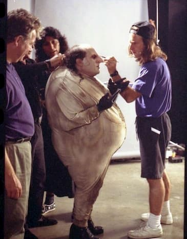
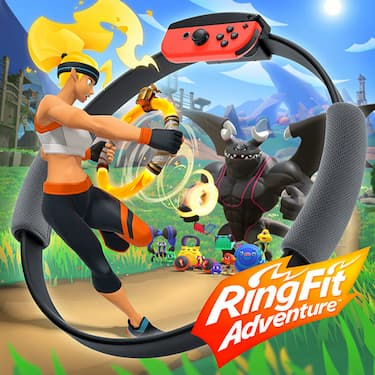

*Vaya, ahora si que me quité un peso de encima*.

Desde muy chico he sido, como mi familia y amigos me describen, de buen comer. No le pongo ningún pero a la cocina de conocidos o desconocidos. Probar algo nuevo es una explosión de sabores que hace de cada bocado una gran experiencia.

En pocas palabras: mi estómago era felíz.

Descubrí que el final de los cuentos donde todos viven felices para siempre no se aplica en la vida real y comencé a tener problemas de salud por mi obesidad.

Agacharme, caminar, estar de pie o el simple hecho de existir me estaban cobrando un gran esfuerzo para seguir realizando estas actividades.

*Tenía que hacer algo*.

¿Alguna vez has visto la película de **Batman regresa**? En esa película aparece el pingüino, interpretado por **Danny DeVito**. Bueno, lo recordé cuando me vi un día en el reflejo de un edificio cuando estaba caminando alegremente.

Ese día fue muy impactante para mí. Tener esa imagen en mi cerebro fue lo que hizo clic para que dijera:

*Es momento de cambiar*.

Compré una báscula para comprobar el horror con datos científicos.

Contuve la respiración.

Subí con miedo mis pies y cerré los ojos esperando a que los números dejaran de subir.

**99 Kilogramos**.

Un número terrible en estas circunstancias.

Y fue así como todo comenzó.

## Los primeros días

Comencé a caminar después del trabajo. Sin embargo los problemas del [COVID-19](https://es.wikipedia.org/wiki/Pandemia_de_COVID-19) hicieron que cesara mis actividades rápidamente. No gimnasios y no ejercicio al aire libre.

Recordé que había comprado el juego [RingFit Adventure](https://www.nintendo.com/games/detail/ring-fit-adventure-switch/) para la Nintendo Switch.

También recordé lo mucho que me había cansado y por ello había dejado de jugarlo en el segundo día.

Bueno, mi determinación era diferente. Así que comencé a jugarlo de **Lunes a Viernes**. 1 hora por la mañana, antes del trabajo. 1 hora por la tarde, después del trabajo.

Nunca pude bajar de peso en los gimnasios a los que asistía. Por lo general nunca tardaba mas de 3 meses y optaba por dejar de ir. La verdad es que no vi cambios enormes.

Por dicha razón, mi meta se estableció en bajar 1 kilogramo al mes.



## El primer mes

Nunca me había puesto a pensar en que ingería bastante comida. El arroz blanco es el acompañamiento primordial en las comidas japonesas, tal como lo es la tortilla en México. Y vaya que las segundas o terceras raciones no faltaban.

Decidí bajar el consumo de los alimentos. También comencé a escuchar mi cuerpo. ¿Quién lo diría? No es normal no poder moverse después de comer.

Me despedí del pan, los refrescos y las frituras. La verdad es que de lo que si sentí feo fue del primero ya que teníamos una amistad de años.

*4 semanas*.

*La hora de la verdad*.

Para esta etapa ya tenía mi rutina definida. Me sentía muy bien jugando "RingFit Adventure" y estaba plenamente confiado en que había bajado 1 kilogramo. Así que me enfrenté al jefe de este nivel.

*Respiré profundamente*.

Subí sin miedo mis pies y permanecí mirando el paisaje a través de la ventana de mi cuarto mientras los números subían con el tiempo.

**95 Kilogramos**.

😱 What?

Yo estaba muy confiado de que en 1 mes estaría bajando 1 kilogramo. Pero los números no mienten. Había perdido 4 kilos. 1 kilogramo por semana.

Investigué sobre ello en varias páginas de internet y con amigos:

> Una pérdida saludable de peso es de 500 a 1000 gramos por semana.

Mi motivación comenzó a crecer y seguí adelante.

## El siguiente paso

Mi ejercicio constaba en ejercicios simples gracias a la ayuda del RingFit. Necesitaba algo mas para reafirmar toda la masa que iría perdiendo. Tenía miedo de tener mucha piel sin refinar.

Es curioso, pero siempre he tenido un par de mancuernas y nunca las había usado. Puedo recordar fácilmente 4 pares de mancuernas que tuve que regalar o vender ya que nunca les dí un uso. 

*Ahora era alguien diferente*.

Encontré una página muy interesante donde comparten diversos planes de ejercicio. Allí fue donde descargué gratuitamente [un plan de solo mancuernas](https://www.muscleandstrength.com/workouts/dumbbell-only-home-or-gym-fullbody-workout.html) que seguí por las siguientes semanas. Para ello debí invertir en un [banco de entrenamiento](https://www.amazon.co.jp/-/en/gp/product/B01M9D4AAW/ref=ppx_yo_dt_b_asin_title_o00_s00?ie=UTF8&psc=1).

Realicé varios experimentos en el transcurso de varias semanas.

Añadí de nueva cuenta el pan en mis comidas (*amo los sándwiches*) y me podía dar el lujo de comer pan dulce algunos fines de semana. Mi pérdida de peso comenzó a variar pero nunca dejó de ser menor a los 500 gramos por semana.

También dejé de hacer ejercicio por las tardes y sólo me dedicaba a realizarlo por las mañanas.

Dejé de usar el elevador. Aún en estos tiempos difíciles por la pandemia, necesitamos ir a conseguir alimentos. El elevador es un espacio reducido donde no se puede aplicar distanciamiento social. Usar las escaleras me ayudó a moverme y evitar la gente. Vaya, nadie usa las escaleras.

## El resultado

Mi historia comenzó con 99 kilogramos. Y bien pude hacer cosplay del gato con el subtítulo de **heavy breathing**.



Hoy en día estoy muy felíz con mis **80 kilogramos**.



Ya no juego tan seguido RingFit, pero me gusta [compartir mis estadísticas en twitter](https://twitter.com/search?q=(%23RingFitAdventure)%20(from%3AAlgusDark)&src=typed_query) para motivarme a seguir haciéndolo. Actualmente llevo más mas de 32 horas de ejercicio. Digo de ejercicio pues al jugar 1 hora, entre diálogos y demás opciones, sólo 25 a 30 minutos son realmente de ejercicio.

## El Aprendizaje

No ha sido un camino sencillo. Pero fue un camino que he disfrutado y sigo disfrutando. Es muy curioso como muchos de mis problemas desaparecieron. Vivir con obesidad por la mayor parte de mi vida me hizo darme cuenta de que mis problemas no eran normales.

Mis consejos son:

- Encuentra el tiempo ideal para realizar ejercicio.
  
  Si crees que no tienes tiempo, encuentra una manera de crear mas tiempo. Yo comencé a despertarme a las *6:30am* para ello. Fue difícil al principio, pero hoy en día estoy muy felíz y satisfecho con los resultados. Luego escribiré sobre ello y otros tips de productividad.

- Establece una meta.
  
  Mi meta era muy pequeña y alcanzable. No puedo decir que sencilla porque todo puede pasar. Sin embargo, conforme a mi experiencia anterior, decidí que era la adecuada para mi. Busca tu meta.

- Escucha tu cuerpo.
  
  Aunque no hice una dieta como tal, el sólo hecho de bajar mi consumo diario mejoró mi salud. Investigué sobre el consumo y quema de calorías. Intenté llevar un diario de calorías pero me fue difícil llevarlo todos los días. Para ello opté por llevarlo rigurosamente una semana y aplicar un estimado mental en las siguientes semanas. Siempre es bueno experimentar.

- Alínea el ejercicio con tus gustos
  
  Sonará algo muy extraño, pero el jugar RingFit hizo que me diera cuenta lo divertido que era hacer ejercicio. Subir de nivel es una experiencia maravillosa ya que hay progreso en tu trabajo. Lo mejor de todo es que se veía reflejado en la vida real. Es como jugar un [MMORPG](https://en.wikipedia.org/wiki/Massively_multiplayer_online_role-playing_game) con puntos de experiencia para asignar y crear el *build* que mas te guste.

## Y al final...

Sólo queda decir que han sido tiempos de comprar nueva ropa.

De hacerle hoyos extras a mis cinturones.

De cosplay con pantalones caídos al estilo cholo.

Pero mas que nada...

*Han sido buenos tiempos*.

**¡Nos leemos!**
